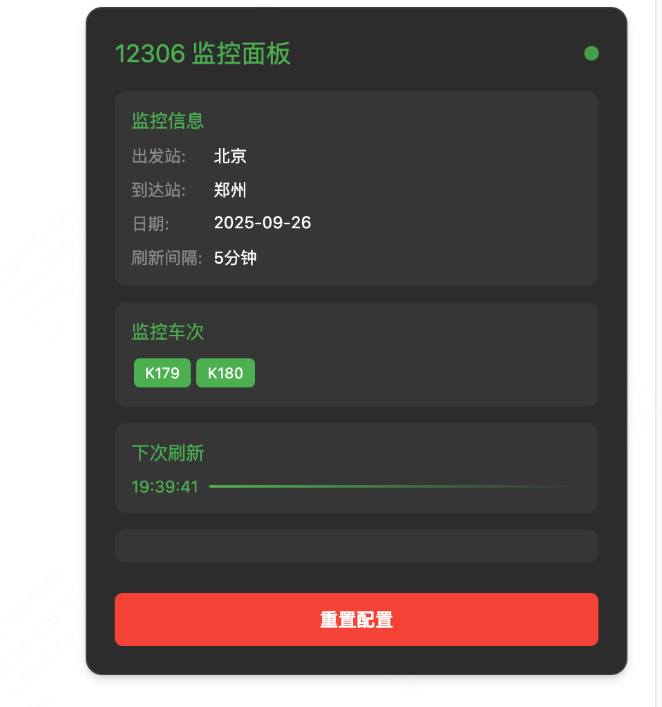
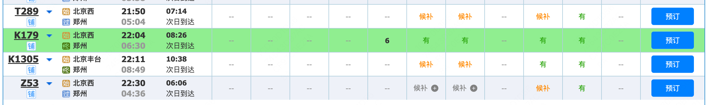
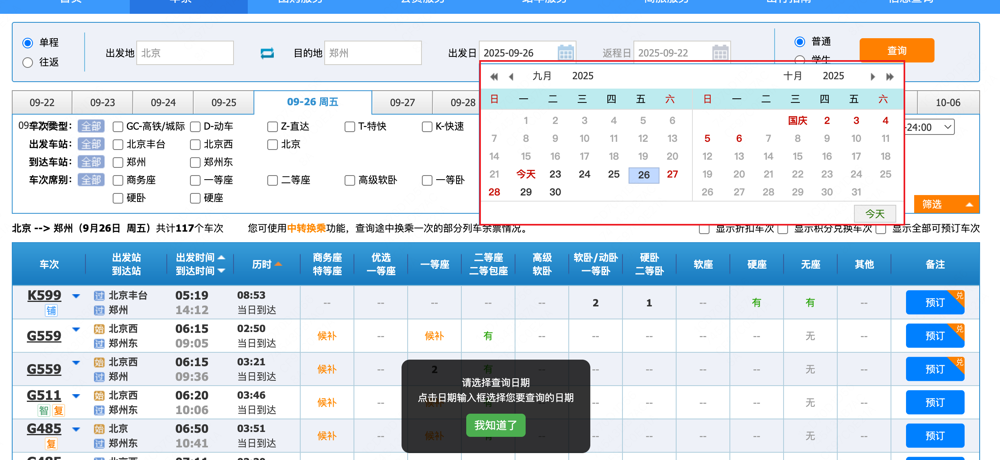
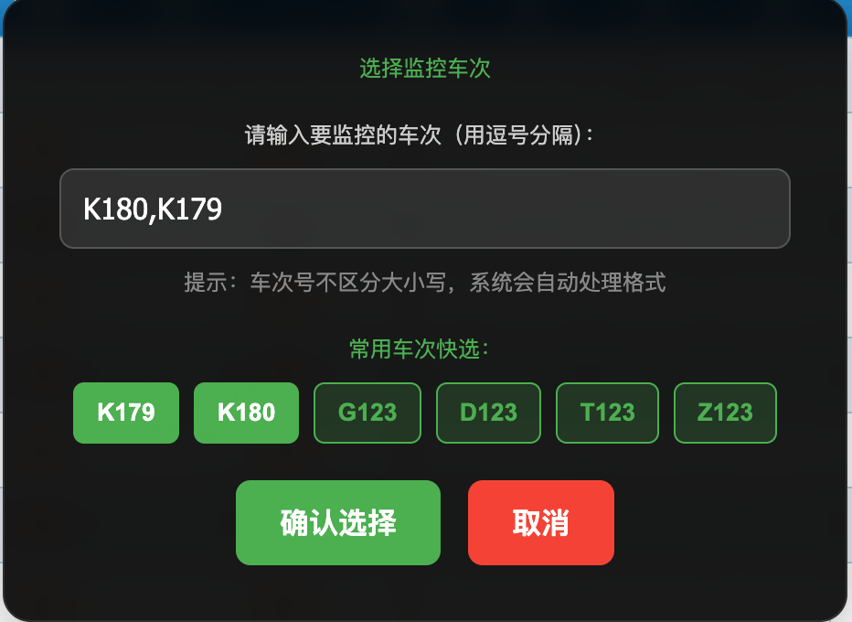
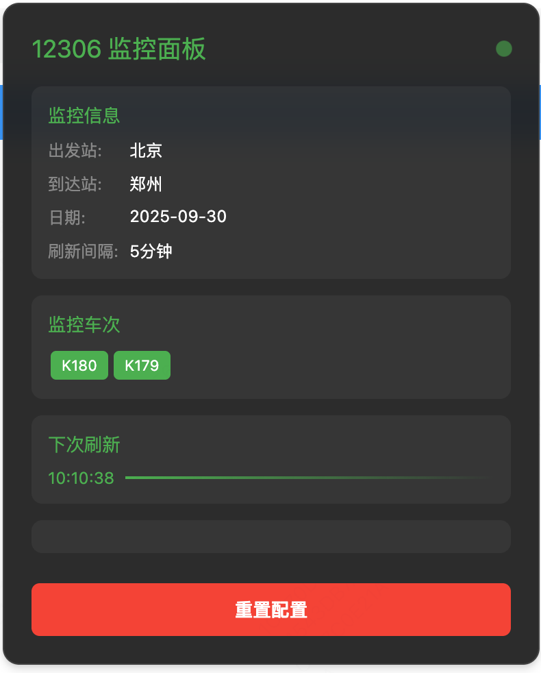

# GreasyFork

## 介绍

GreasyFork 是一个用户脚本管理器，它允许用户上传和分享自己的脚本，以增强浏览器的功能。

## 12306_check_status

### CHANGELOG
1.1.0
1. 增加监控车次面板，可以通过输入火车常用车次选择监控
2. 监控日期选择优化。
3. 使用方式可点击面板重置后使用。

附图

## code_goto_hpx

## mt_code_pr_review
无图，就是自动化了pr review流程。